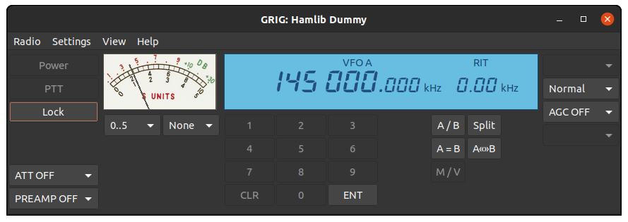

# Grig

## About

**Grig** is a graphical user interface for the Ham Radio Control Libraries. It is
intended to be simple and generic, presenting the user with the same interface
regardless of which radio they use.



## Installing Grig from Source

Assuming that you have obtained and unpacked source distribution, you can
install **grig** by typing the following (in the top-level source directory):

```bash
autoreconf -i
./configure
make
sudo make install
```

You likely miss some of the required libraries if you get any error messages during
 `configure`. These are:

* `gtk+-2.0`      at least version 2.12.0
* `gthread-2.0`   at least version 2.14.0
* `hamlib`        at least version 4.0

Please note that you also need the so-called development packages which
contain the necessary header files.

If you are already familiar with this kind of installation process, you may
want to fine-tune the build and installation. You can do this by specifying various
command line arguments to the `configure` script. See `configure --help` for details.

If you obtained the **grig** sources from the CVS/Git repository, you have to run the
`autogen.sh` script instead of the `configure` script. Any command line argument
you would like to pass to `configure` can be passed to `autogen.sh` as well.

Once you have installed **grig**, you can get a brief overview of its usage by
reading the manual page. A summary of the command line options is also
printed when typing `grig --help`.

## Getting Support

If you encounter any problems using **grig**, you are welcome to ask for support on
the mailing list or user forums. You can find them on the Groundstation project
page at SourceForge:

[http://sourceforge.net/projects/groundstation](http://sourceforge.net/projects/groundstation)

## License

[COPYING](COPYING)
